# CPS3 NOS (NOR Open SIMM)

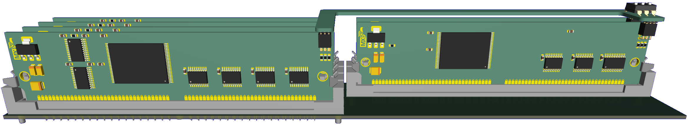

CPS3 NOS is an alternative to the original SIMMs for CPS3; currently, the available options include clone SIMMs with old-stock FLASH memory and Ultra SIMMs by DS. 

CPS3 NOS works similarly to Ultra SIMMs, allowing you to store up to 8 titles and switch between them using a DIP switch.

This implementation avoids using ribbon cables because I prefer not to use or solder them, however, you are free to create your own SIMM switch using the provided source files.


## Assembly/Production  

Gerber, BOM, and POS files are provided in the `hw` directory. You can send them directly to a PCB fabrication company or assemble the boards yourself.  

When assembling, consider that the minimum pitch is **0.5mm**, and the footprint for capacitors and resistors is **0603**.

**Important!!!**, PCB tickness it's **1.2mm**

### 64MB SIMM  

For 64MB SIMMs, you can use the following parallel NOR FLASH memory chips:  

- **Micron MT28EW256/512/01G**  
- **Spansion S29256/512/GL01G** (use the 100ns speed version)  

### 128MB SIMM  

For 128MB SIMMs, only **Micron MT28EW01G** parallel NOR FLASH is supported. During development and testing, **Spansion** memory did not work as expected with bank switching on the 128MB SIMM.  

### Notes  

- Use only one type of SIMM when assembling a single **64MB SIMM**.  
- You can mix **Micron** and **Spansion** SIMMs if needed.  


## How to use

CPS3 can only handle four types of FLASH memory due to the instructions used for flashing new games through the system, these instructions are supported and coded in the BIOS.  

To make a new NOR FLASH memory compatible with CPS3, a BIOS patch is required.

### BIOS Patch

The **bios_patch.py** script allows you to apply patches to your current BIOS, adding compatibility for **SPANSION** and **MICRON** NOR FLASH.

For example, if you have a dump of *Street Fighter III 3rd Strike*, you can execute the following command to patch BIOS:

```bash
python bios_patch.py sfiii3_usa.29f400.u2 sfiii3
```


#### Compatibility Table

| Before patch | After patch          |
|--------------|----------------------|
| MXCI         | MXCI                 |
| SHARP/INTEL  | SHARP/INTEL          |
| HITACHI      | SPANSION             |
| MXIC         | MICRON NOS/UltraSIMM |


### Flashing Your New BIOS

Once the patch is applied, it's time to flash your updated BIOS onto the cartridge. There are two main methods you can use:

1. **Using the [CPS3 SIMM/CARTRIDGE PORT ADAPTER for OSCR](https://github.com/herzmx/CPS3-OSCR-Adapter)**  
   - This method works for both alive and death cartridges.
   - **NOTE**: Use it at your own risk on alive cartridges!

2. **Traditional Method**  
   - Remove the 29F400 chip from the cartridge and flash it using a programmer.  
   - This method is only recommended for death cartridges.

Now your cartdrige it's compatible with NOS!

### R/W CPS3 NOS 

Currently, CPS3 NOS can only be programmed using the [CPS3 SIMM/CARTRIDGE PORT ADAPTER for OSCR](https://github.com/herzmx/CPS3-OSCR-Adapter).

#### Prepare your files 

- **Dump or copy**  your CD-ROM files and organize them into a directory. For example, for *Street Fighter III: 2nd Impact*, the directory structure should look like this:

	```
    CDROM
    └── SFIII2
        ├── 10
        ├── 20
        ├── 30
        ├── 31
        ├── 40
        ├── 41
        ├── 50
        ├── 51
        ├── 90
        ├── 91
        ├── 92
        └── 93
	```

- Concatenate files for each SIMM
	- For **128M SIMMs**, use files 3# to 6#. 
	- For **64M SIMMs**, use files 10 and 20.
	
	 Example (using a Unix terminal):
	 
	 ```bash
	 	cat WAZARD/10WZ SFIII/10NG SFIII2/10 JOJO/10JO SFIII3B/103S2 JOJOBA/10JB > NOS10

		cat WAZARD/10WZFix SFIII/10NG SFIII2/10 JOJO/10JO SFIII3B/103S2 JOJOBA/10JB > NOS10
		
		cat WAZARD/20WZ SFIII/20NG SFIII2/20 JOJO/20JO SFIII3B/203S2 JOJOBA/20JB > NOS20
		
		cat WAZARD/30WZ WAZARD/31WZ SFIII/30NG SFIII/31NG SFIII2/30 SFIII2/31 JOJO/30JO JOJO/31JO SFIII3B/303S2 SFIII3B/313S2 JOJOBA/30JB JOJOBA/31JB > NOS30
		
		cat WAZARD/40WZ WAZARD/41WZ SFIII/40NG SFIII/41NG SFIII2/40 SFIII2/41 JOJO/40JO JOJO/41JO SFIII3B/403S2 SFIII3B/413S2 JOJOBA/40JB JOJOBA/41JB > NOS40
		
		cat WAZARD/50WZ WAZARD/51WZ SFIII/50NG SFIII/51NG SFIII2/50 SFIII2/51 JOJO/50JO JOJO/51JO SFIII3B/503S2 SFIII3B/513S2 JOJOBA/50JB JOJOBA/51JB > NOS50
		
		cat WAZARD/60WZ WAZARD/61WZ SFIII/60NG SFIII/61NG SFIII2/60 SFIII2/61 JOJO/60JO JOJO/61JO SFIII3B/603S2 SFIII3B/613S2 JOJOBA/60JB JOJOBA/61JB > NOS60
	 ```
	 
**Important Notes**
 
- NOS supports up to 8 titles. When using this feature, you must fill all SIMM slots and space.
- For example, when working with *Street Fighter III: New Generation*, you can duplicate certain files to fill all space:
- Use `10` as `20` for SIMM 2.
- Use `50` four times for SIMM 5.
- Use `40` as `60 `for SIMM 6.
 	
|                                             | 1      | 2      | 3       | 4       | 5       | 6       |
|---------------------------------------------|--------|--------|---------|---------|---------|---------|
| Street Fighter III: New Generation          | 64MBit | -      | 128MBit | 128MBit | 32MBit  | -       |
| Street Fighter III: New Generation (filled) | 64MBit | 64MBit | 128MBit | 128MBit | 128MBit | 128MBit |
 	

Alternatively, you can use the **ds2nos.py** script to convert UltraSIMM files to NOS format.

#### Write NOS

The [CPS3 SIMM/CARTRIDGE PORT ADAPTER for OSCR](https://github.com/herzmx/CPS3-OSCR-Adapter) has designated slots for 64M and 128M SIMMs. Insert your NOS into the corresponding slot and connect the headers for additional addressing.


- Prepare your SD, copy NOS10* to NOS60* in root
- Use *Capcom System III* menu options to write files
- 128 MB

	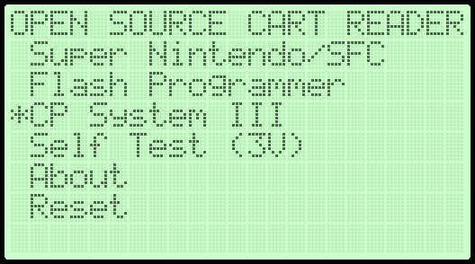
	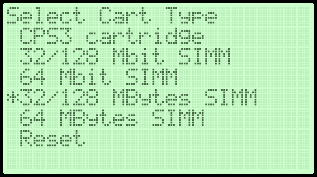
	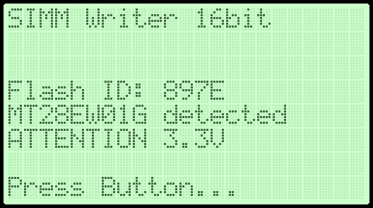
	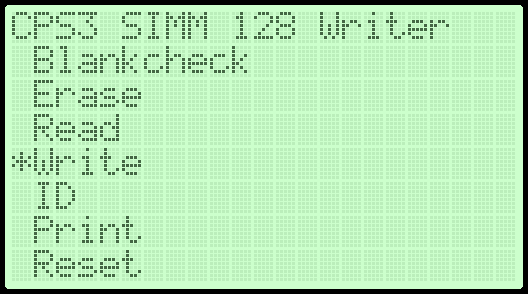
	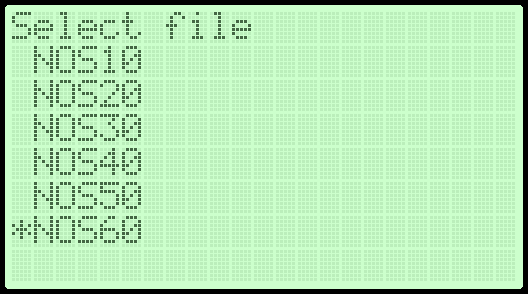
	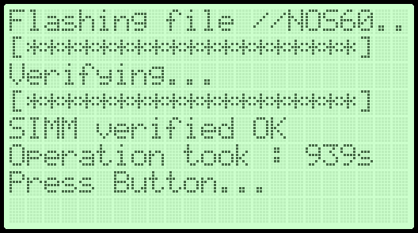

- 64 MB

	
	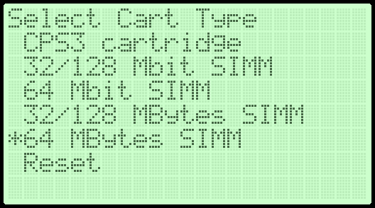
	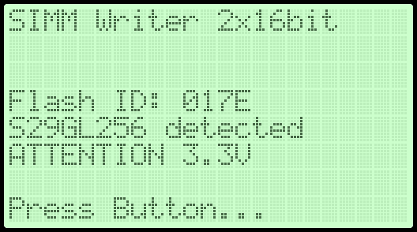
	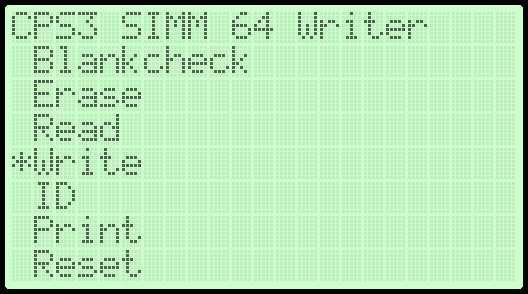
	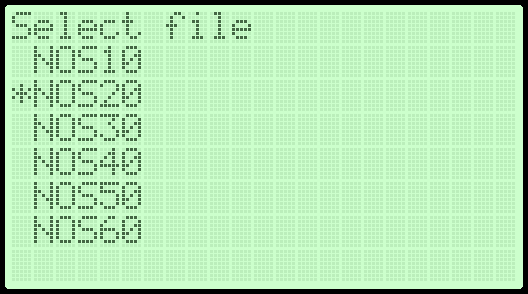
	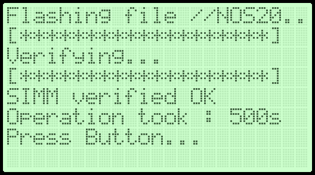


### Install NOS on CPS3

- After writing all the NOS, install the SIMMs into the CPS3. It is recommended to label each SIMM to prevent any mix-ups in the future.


- Install the SW header to link all NOS if you plan to use more than one title.


### NOS SW Reference Table

| SW Config                   |        |
|-----------------------------|--------|
|  | GAME 1 |
|  | GAME 2 |
| 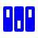 | GAME 3 |
|  | GAME 4 |
|  | GAME 5 |
|  | GAME 6 |
|  | GAME 7 |
|  | GAME 8 |


## Disclaimer!!!

**I am not responsible for any damage to your CPS3 cartridges or system. At this time, it remains untested in live cartridges, so use it at your own risk!**

## License
<a rel="license" href="http://creativecommons.org/licenses/by-nc-sa/4.0/"></a><br />This work is licensed under a <a rel="license" href="http://creativecommons.org/licenses/by-nc-sa/4.0/">Creative Commons Attribution-NonCommercial-ShareAlike 4.0 International</a>. You are able to reusers to distribute, remix, adapt, and build upon the material in any medium or format for noncommercial purposes only, and only so long as attribution is given. If you remix, adapt, or build upon the material, you must license the modified material under identical terms.